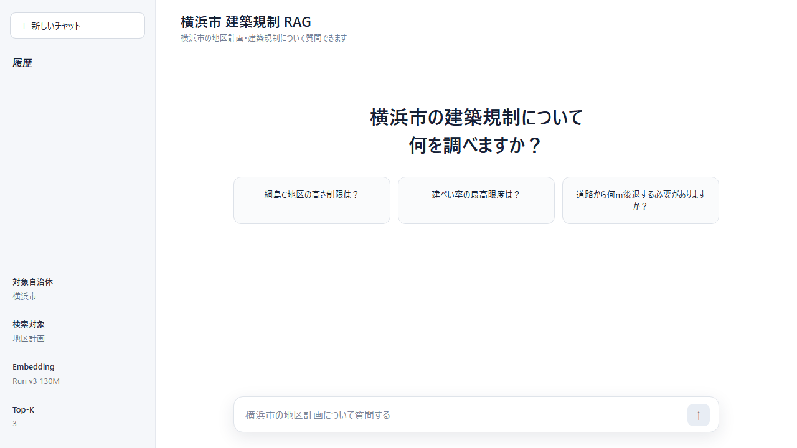
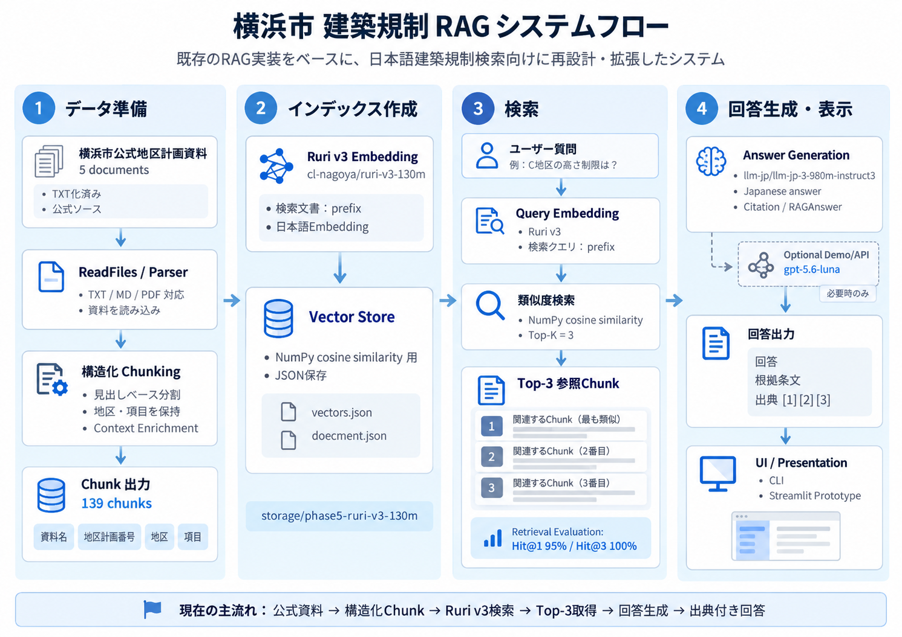

## RAGについて

RAG（Retrieval-Augmented Generation）は、質問に関連する情報を外部文書から検索し、その結果をコンテキストとして LLM に渡して回答を生成する仕組みです。処理は Retrieval、Augmentation、Generation の3段階で構成されます。

本プロジェクトでは、横浜市の地区計画文書から質問に対応する規制を Top-3 で検索し、取得した Chunk だけを根拠として日本語回答を生成します。文書名・地区・規制項目を保持した検索結果と Citation を組み合わせ、回答根拠を確認できる構成にしています。

---

<div align="center">
  <h1>横浜市 建築規制 RAG</h1>
  <p><strong>横浜市の公式地区計画を対象とした、日本語建築規制検索・回答生成システム</strong></p>
  <p>
    
    
    
    
    
  </p>
</div>

既存の RAG 実装をベースに、日本語建築規制検索向けに文書構造化、Chunk 設計、日本語 Embedding、回答生成、引用表示、UI を再設計・拡張した RAG システムです。

## Demo

<p align="center">
  
</p>

Streamlit Demo: [https://02archi-projectrag-based-app-system.streamlit.app/](https://02archi-projectrag-based-app-system.streamlit.app/)

## プロジェクト概要

対象は、横浜市が公開している地区計画・建築規制文書です。複数の地区計画には「建ぺい率」「高さ」「壁面の位置」「敷地面積」「用途」など共通する規制項目が存在しますが、適用地区や数値は文書ごとに異なります。

本プロジェクトでは、公式文書を地区・項目単位で構造化し、日本語検索に適した Ruri v3 でベクトル化します。質問とのコサイン類似度から Top-3 Chunk を検索し、ローカル日本語 LLM または明示的に選択した OpenAI API へ渡して、参照元付きの回答を生成します。

## Project Highlights

| 項目 | 実装内容 |
|---|---|
| 公式データ | 横浜市の地区計画 5 文書を構造化 |
| Knowledge Base | 139 Chunk、JSON 形式でベクトルを永続化 |
| Chunk 設計 | 見出しと本文を保持し、資料名・地区計画番号・地区・項目を付加 |
| Embedding | `cl-nagoya/ruri-v3-130m` と文書・クエリ別 Prefix |
| Retrieval | NumPy によるコサイン類似度計算と Top-3 検索 |
| Evaluation | 20 問で Hit@1 95%、Hit@3 100% |
| Answer Generation | ローカル日本語 LLM を開発時の既定値として使用 |
| Optional API | `gpt-5.6-luna` を明示選択できる Responses API 経路 |
| Source Output | 独自の `Citation` / `RAGAnswer` データ構造 |
| UI | Streamlit によるモックベースの UI プロトタイプ |

## 解決したい課題

建築規制文書では、異なる地区計画に同じ名称の規制項目が繰り返し登場します。たとえば、複数の文書に「建築物の高さの最高限度」が存在しても、対象地区や上限値は同じとは限りません。

単純な意味類似度だけでは、正しい規制項目を見つけても別文書・別地区の値を取得する可能性があります。そのため、本プロジェクトでは次の3要素を Chunk に保持しています。

- 文書：どの地区計画か
- 地区：どの区分に適用されるか
- 項目：どの規制を扱っているか

この Context Enrichment により、類似した見出しを持つ複数文書間で検索対象を区別します。

## System Architecture

<p align="center">
  
</p>

現在の処理は、公式文書の読み込み・構造化・Embedding・JSON 保存からなる索引処理と、質問の Embedding・Top-3 検索・回答生成・Citation 出力からなる検索処理で構成されています。

## Data / Knowledge Base

Knowledge Base には、横浜市が公開する次の5件の公式地区計画を使用しています。

| 地区計画番号 | 資料名 |
|---|---|
| C-028 | 都筑関耕地地区地区計画 |
| C-042 | 港北ニュータウン中央地区地区計画 |
| C-066 | 鶴見潮田・本町通街並み誘導地区地区計画 |
| C-070 | 日本大通り用途誘導地区地区計画 |
| C-102 | 綱島サスティナブル・スマートタウン地区地区計画 |

各 TXT には、可能な範囲で次の文書メタデータを保持しています。

- `資料名`
- `地区計画番号`
- `自治体`
- `位置`
- `都市計画決定`
- `出典`
- `URL` または `原文URL`

現在の5文書から 139 Chunk を生成しています。原文確認に使用できる横浜市公式ページの URL も各データファイルに保持しています。

## Document Processing

初期のトークン長ベースの分割に、地区計画向けの見出し認識と Context Enrichment を追加しています。

```text
単純なトークン分割
  → 【見出し】単位の分割
  → 文書・地区・項目 Context の付加
```

`【建築物の高さの最高限度】` のような見出しは本文と同じ Chunk に保持されます。各規制 Chunk の先頭には、検索時の識別情報として次の形式を付加します。

```text
資料名：綱島サスティナブル・スマートタウン地区地区計画
地区計画番号：C-102
地区：C地区
項目：建築物の高さの最高限度
```

1 Chunk の上限は 600 token、長い節を分割する場合のオーバーラップは 150 文字です。

## Retrieval

### Embedding

日本語 Retrieval 向けモデルとして、`cl-nagoya/ruri-v3-130m` を使用しています。文書と質問には、コード上で次の Prefix を付けて別々に Embedding します。

```text
文書：検索文書: {chunk}
質問：検索クエリ: {question}
```

### Ranking

Ruri v3 が文書と質問の Embedding を生成し、`VectorStore` が NumPy でコサイン類似度を計算します。類似度を降順に並べ、上位3件を回答生成へ渡します。

```text
Ruri v3 Embedding → NumPy cosine similarity → Top-3
```

Ruri v3 は Embedding モデルであり、Vector Store ではありません。生成した 512 次元ベクトルと Chunk 本文は、現在 JSON 形式で保存しています。

```text
storage/phase5-ruri-v3-130m/
├─ document.json
└─ vectors.json
```

## Retrieval Evaluation

異なる文書・地区・項目・値を含む20問を用いて、正しい Chunk が検索順位内に入るかを評価しました。

| Metric | Result |
|---|---:|
| Documents | 5 |
| Chunks | 139 |
| Evaluation Questions | 20 |
| Hit@1 | 19/20（95%） |
| Hit@3 | 20/20（100%） |

- **Hit@1**：検索結果の1位が、期待する文書・地区・項目・値をすべて含む割合
- **Hit@3**：検索結果の上位3件以内に、期待する Chunk が含まれる割合

これらは Retrieval の評価値です。LLM の回答正解率、幻覚率、Precision、Recall、MRR、Latency を表すものではありません。

## Answer Generation

取得した Top-3 Chunk は、番号付きの参照資料として回答生成モデルへ渡されます。モデルには、参照資料だけを根拠に日本語で回答し、確認できない場合は `提供された資料からは確認できません。` と返すよう指示しています。

### Development / Testing

既定の生成器はローカルモデルです。

```text
llm-jp/llm-jp-3-980m-instruct3
```

PyTorch と Hugging Face Transformers で実行するため、通常の開発・検証では API 費用が発生しません。

### Optional Demo / API Generation

`--generator openai` を明示した場合のみ、`OpenAIChat` が Responses API の `gpt-5.6-luna` を使用します。コード経路は実装済みですが、本リポジトリでは実 API による回答品質評価結果を掲載していません。

どちらの生成器も共通して `RAGAnswer` を返し、Top-3 Chunk のメタデータから `Citation` を構築します。

```text
Top-3 Chunk → LLM → Japanese Answer → RAGAnswer + Citation
```

## Streamlit UI

`app/streamlit_app.py` には、チャット履歴、質問入力、回答、規制情報、出典、参照 Chunk を表示する Streamlit UI を実装しています。

現在は `app/mock_data.py` の固定データを表示するプロトタイプです。Ruri v3、VectorStore、ローカル LLM、OpenAI API を使用する実 RAG バックエンドとはまだ接続していません。

## Project Structure

```text
architecture file-on-RAG/
├─ example.py                       # 索引作成・検索評価・回答生成の CLI
├─ requirements.txt
├─ .env.example
├─ README.md
├─ paper.md
│
├─ RAG/
│  ├─ Embeddings.py                 # Ruri v3 Embedding 実装
│  ├─ LLM.py                        # LocalHFChat / OpenAIChat / Citation
│  ├─ VectorBase.py                 # JSON 永続化と類似度検索
│  └─ utils.py                      # 文書読込と Chunk 分割
│
├─ app/
│  ├─ streamlit_app.py              # Streamlit UI プロトタイプ
│  └─ mock_data.py                  # UI 用モック回答
│
├─ data/
│  └─ phase5/                       # 横浜市公式地区計画 5 文書
│
├─ storage/
│  └─ phase5-ruri-v3-130m/          # 139 Chunk の JSON Vector Store
│
└─ docs/
   └─ reference_README.md            # 原プロジェクトの出典・改修範囲
```

## Setup

### 1. Python 環境

Python 3.10 以上を使用します。Conda を利用する場合の例です。

```powershell
conda create -n rag-learning python=3.10
conda activate rag-learning
python -m pip install -r requirements.txt
```

### 2. ローカル回答生成

ローカル生成が既定値です。

```powershell
python .\example.py --question "綱島地区の高さ制限は？" --generator local
```

初回は Hugging Face からモデルファイルを取得します。現在の `example.py` は、実行時に索引を生成・保存し、20問の Retrieval 評価を実行した後、指定された質問への回答を生成します。

### 3. OpenAI API（任意）

OpenAI 経路を利用する場合だけ、`.env.example` を参考にプロジェクトルートへ `.env` を作成します。

```env
OPENAI_API_KEY=your_api_key_here
```

`.env` は `.gitignore` の対象です。API キーをソースコードやコミットへ含めないでください。

```powershell
python .\example.py --question "綱島地区の高さ制限は？" --generator openai
```

### 4. Streamlit UI プロトタイプ

```powershell
streamlit run app\streamlit_app.py
```

この UI が表示する回答は現在モックデータです。

## Limitations

- 検索できる資料は、横浜市の地区計画 5 文書のみです。
- 現在の検索方法は、データが増えると処理に時間がかかる可能性があります。
- 検索精度の確認に使った質問は 20 問だけなので、さらに多くの質問で確認する必要があります。
- 回答の正しさや、示した根拠が回答内容と合っているかについては、まだ十分に評価できていません。
- 出典には検索結果の上位 3 件を表示します。回答作成に実際に使われた出典だけを選ぶ機能はありません。
- Streamlit の画面はモックデータを表示する試作版で、実際の RAG システムとはまだ接続していません。
- 住所や座標を入力して、該当する地区計画を自動で探すことはできません。

## Future Work

- 横浜市公式地区計画の収録範囲拡大
- Streamlit UI と実 RAG パイプラインの統合
- 回答正確性・根拠整合性・回答不能判定の評価セット整備
- 文書・地区・規制項目による Metadata Filtering
- Keyword Search を組み合わせた Hybrid Retrieval
- 大規模 corpus 向け Vector Database への移行
- 住所・地番・GIS 情報からの適用規制検索
- Demo 画像、アーキテクチャ図、デプロイ環境の整備

## References

### Official Data

- [C-028 都筑関耕地地区｜横浜市](https://www.city.yokohama.lg.jp/kurashi/machizukuri-kankyo/toshiseibi/plan-rule/chikukeikaku/kubetsu/tsuzuki/c-028.html)
- [C-042 港北ニュータウン中央地区｜横浜市](https://www.city.yokohama.lg.jp/kurashi/machizukuri-kankyo/toshiseibi/plan-rule/chikukeikaku/kubetsu/tsuzuki/c-042.html)
- [C-066 鶴見潮田・本町通街並み誘導地区｜横浜市](https://www.city.yokohama.lg.jp/kurashi/machizukuri-kankyo/toshiseibi/plan-rule/chikukeikaku/kubetsu/tsurumi/c-066.html)
- [C-070 日本大通り用途誘導地区｜横浜市](https://www.city.yokohama.lg.jp/kurashi/machizukuri-kankyo/toshiseibi/plan-rule/chikukeikaku/kubetsu/naka/c-070.html)
- [C-102 綱島サスティナブル・スマートタウン地区｜横浜市](https://www.city.yokohama.lg.jp/kurashi/machizukuri-kankyo/toshiseibi/plan-rule/chikukeikaku/kubetsu/kohoku/c-102.html)

### Models

- [cl-nagoya/ruri-v3-130m](https://huggingface.co/cl-nagoya/ruri-v3-130m)
- [llm-jp/llm-jp-3-980m-instruct3](https://huggingface.co/llm-jp/llm-jp-3-980m-instruct3)
- [GPT-5.6 Luna](https://developers.openai.com/api/docs/models/gpt-5.6-luna)

### Papers

- [When Large Language Models Meet Vector Databases: A Survey](https://arxiv.org/abs/2402.01763)
- [Retrieval-Augmented Generation for Large Language Models: A Survey](https://arxiv.org/abs/2312.10997)
- [Learning to Filter Context for Retrieval-Augmented Generation](https://arxiv.org/abs/2311.08377)
- [In-Context Retrieval-Augmented Language Models](https://arxiv.org/abs/2302.00083)
